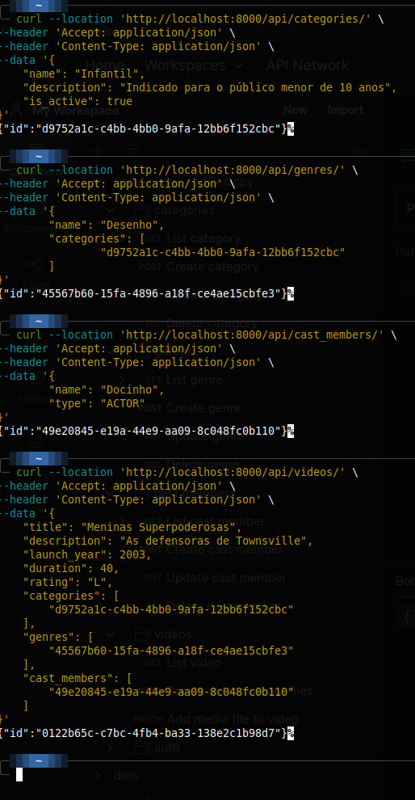

# Codeflix Project

## Overview

Codeflix is a project designed to manage categories and genres for a media catalog. It includes functionalities for creating, updating, listing, and deleting categories, genres, cast members and videos. The project is structured to support both unit and integration tests, ensuring robust and reliable code.

## Features

- Create, get, update, list, and delete categories.
- Create, update, list and delete genres and castmembers.
- Create video without media and get it.
- Integration with Django Rest Framework for API endpoints.
- Comprehensive test coverage using pytest.
- Docker support for containerized deployment.

## API Endpoints

#### It's important to end the end-point with / (slash)

### Categories

- `GET /api/categories/` - List all categories
- `POST /api/categories/` - Create a new category
- `PUT /api/categories/{id}/` - Update a category by ID
- `PATCH /api/categories/{id}/` - Partially update a category by ID
- `DELETE /api/categories/{id}/` - Delete a category by ID

### Genres

- `GET /api/genres/` - List all genres
- `POST /api/genres/` - Create a new genre
- `PUT /api/genres/{id}/` - Update a genre by ID
- `DELETE /api/genres/{id}/` - Delete a genre by ID

### Cast Members

- `GET /api/cast_members/` - List all cast members
- `POST /api/cast_members/` - Create a new cast member
- `PUT /api/cast_members/{id}/` - Update a cast member by ID
- `DELETE /api/cast_members/{id}/` - Delete a cast member by ID

### Videos

- `POST /api/videos/` - Create a new video without media
- `GET /api/videos/{id}/` - Retrieve a video by ID

### Flash test commands

#### Creating a category

```bash
curl --location 'http://localhost:8000/api/categories/' \
--header 'Accept: application/json' \
--header 'Content-Type: application/json' \
--data '{
    "name": "Infantil",
    "description": "Indicado para o público menor de 10 anos",
    "is_active": true
}'
```

#### Creating a genre

- Replace the content of cateogries inside brackets for previous creation response.

```bash
curl --location 'http://localhost:8000/api/genres/' \
--header 'Accept: application/json' \
--header 'Content-Type: application/json' \
--data '{
	"name": "Desenho",
	"categories": [
		"d9752a1c-c4bb-4bb0-9afa-12bb6f152cbc"
	]
}'
```

#### Creating a cast member

```bash
curl --location 'http://localhost:8000/api/cast_members/' \
--header 'Accept: application/json' \
--header 'Content-Type: application/json' \
--data '{
	"name": "Docinho",
	"type": "ACTOR"
}'
```

- Replace the content of cateogries, genres and cast_members inside brackets for previous creations response.

```bash
curl --location 'http://localhost:8000/api/videos/' \
--header 'Accept: application/json' \
--header 'Content-Type: application/json' \
--data '{
    "title": "Meninas Superpoderosas",
    "description": "As defensoras de Townsville",
    "launch_year": 2003,
    "duration": 40,
    "rating": "L",
    "categories": [
        "d9752a1c-c4bb-4bb0-9afa-12bb6f152cbc"
    ],
    "genres": [
        "45567b60-15fa-4896-a18f-ce4ae15cbfe3"
    ],
    "cast_members": [
        "49e20845-e19a-44e9-aa09-8c048fc0b110"
    ]
}'
```

<p align="center">
  
</p>

## Getting Started

### Prerequisites

- Python 3.10+
- Docker (optional, for containerized deployment)

### Installation

1. Clone the repository:

   ```sh
   git clone https://github.com/edsonjabastos/codeflix.git
   cd codeflix
   ```

2. Create a virtual environment and activate it:

   ```sh
   python3 -m venv venv
   source venv/bin/activate
   ```

3. Install the required packages:

   ```sh
   pip install -r requirements.txt
   ```

### Running the Project

1. Apply migrations:

   ```sh
   python src/manage.py migrate
   ```

2. Run the development server:

   ```sh
   python src/manage.py runserver
   ```

3. Access the application at `http://127.0.0.1:8000/`.

### Running Tests

To run the tests, use the following command:

```sh
pytest
```

### Using Docker

1. Build the Docker image:

   ```sh
   docker build -t codeflix-catalog-admin .
   ```

2. Run the Docker container:

   ```sh
   docker run -d -v ./src:/app codeflix-catalog-admin
   ```

## Project Structure

```
.
├── Dockerfile
├── README.md
├── requirements.txt
├── src
│   ├── config.py
│   ├── core
│   │   ├── castmember
│   │   │   ├── application
│   │   │   │   ├── exceptions.py
│   │   │   │   └── use_cases
│   │   │   │       ├── create_castmember.py
│   │   │   │       ├── delete_castmember.py
│   │   │   │       ├── list_castmember.py
│   │   │   │       └── update_castmember.py
│   │   │   ├── domain
│   │   │   │   ├── castmember.py
│   │   │   │   ├── castmember_repository.py
│   │   │   │   └── value_objects.py
│   │   │   ├── infra
│   │   │   │   └── in_memory_castmember_repository.py
│   │   │   └── tests
│   │   │       ├── domain
│   │   │       │   └── test_castmember.py
│   │   │       └── use_cases
│   │   │           ├── integration
│   │   │           │   ├── test_create_castmember.py
│   │   │           │   ├── test_delete_castmember.py
│   │   │           │   ├── test_list_castmember.py
│   │   │           │   └── test_update_castmember.py
│   │   │           └── unit
│   │   │               ├── test_create_castmember.py
│   │   │               ├── test_delete_castmember.py
│   │   │               ├── test_list_castmember.py
│   │   │               └── test_update_castmember.py
│   │   ├── category
│   │   │   ├── application
│   │   │   │   └── use_cases
│   │   │   │       ├── create_category.py
│   │   │   │       ├── delete_category.py
│   │   │   │       ├── exceptions.py
│   │   │   │       ├── get_category.py
│   │   │   │       ├── list_category.py
│   │   │   │       └── update_category.py
│   │   │   ├── domain
│   │   │   │   ├── category.py
│   │   │   │   └── category_repository.py
│   │   │   ├── infra
│   │   │   │   └── in_memory_category_repository.py
│   │   │   └── tests
│   │   │       ├── application
│   │   │       │   └── use_cases
│   │   │       │       ├── integration
│   │   │       │       │   ├── test_create_category.py
│   │   │       │       │   ├── test_delete_category.py
│   │   │       │       │   ├── test_get_category.py
│   │   │       │       │   ├── test_list_category.py
│   │   │       │       │   └── test_update_category.py
│   │   │       │       └── unit
│   │   │       │           ├── test_create_category.py
│   │   │       │           ├── test_delete_category.py
│   │   │       │           ├── test_get_category.py
│   │   │       │           ├── test_list_category.py
│   │   │       │           └── test_update_category.py
│   │   │       ├── domain
│   │   │       │   └── test_category.py
│   │   │       └── infra
│   │   │           └── test_in_memory_category_repository.py
│   │   ├── genre
│   │   │   ├── application
│   │   │   │   ├── exceptions.py
│   │   │   │   └── use_cases
│   │   │   │       ├── create_genre.py
│   │   │   │       ├── delete_genre.py
│   │   │   │       ├── list_genre.py
│   │   │   │       └── update_genre.py
│   │   │   ├── domain
│   │   │   │   ├── genre.py
│   │   │   │   └── genre_repository.py
│   │   │   ├── infra
│   │   │   │   └── in_memory_genre_repository.py
│   │   │   └── tests
│   │   │       ├── application
│   │   │       │   └── use_cases
│   │   │       │       ├── integration
│   │   │       │       │   ├── test_create_genre.py
│   │   │       │       │   ├── test_delete_genre.py
│   │   │       │       │   ├── test_list_genre.py
│   │   │       │       │   └── test_update_genre.py
│   │   │       │       └── unit
│   │   │       │           ├── test_create_genre.py
│   │   │       │           ├── test_delete_genre.py
│   │   │       │           ├── test_list_genre.py
│   │   │       │           └── test_update_genre.py
│   │   │       └── domain
│   │   │           └── test_genre.py
│   │   ├── _shared
│   │   │   ├── entity.py
│   │   │   ├── list_use_case.py
│   │   │   └── notification.py
│   │   └── video
│   │       ├── application
│   │       │   ├── exceptions.py
│   │       │   └── use_cases
│   │       │       ├── create_video_without_media.py
│   │       │       └── get_video.py
│   │       ├── domain
│   │       │   ├── value_objects.py
│   │       │   ├── video.py
│   │       │   └── video_repository.py
│   │       ├── infra
│   │       │   └── in_memory_video_repository.py
│   │       └── tests
│   │           ├── application
│   │           │   └── use_cases
│   │           │       ├── integration
│   │           │       │   └── test_create_video_without_media.py
│   │           │       └── unit
│   │           │           └── test_create_video_without_media.py
│   │           ├── domain
│   │           │   └── test_video.py
│   │           └── infra
│   │               └── test_in_memory_video_repository.py
│   ├── db.sqlite3
│   ├── django_project
│   │   ├── asgi.py
│   │   ├── castmember_app
│   │   │   ├── admin.py
│   │   │   ├── apps.py
│   │   │   ├── migrations
│   │   │   │   └── 0001_initial.py
│   │   │   ├── models.py
│   │   │   ├── repository.py
│   │   │   ├── serializers.py
│   │   │   ├── tests
│   │   │   │   ├── test_castmember_api.py
│   │   │   │   └── test_repository.py
│   │   │   └── views.py
│   │   ├── category_app
│   │   │   ├── admin.py
│   │   │   ├── apps.py
│   │   │   ├── migrations
│   │   │   │   ├── 0001_initial.py
│   │   │   │   └── 0002_alter_category_table.py
│   │   │   ├── models.py
│   │   │   ├── repository.py
│   │   │   ├── serializers.py
│   │   │   ├── test
│   │   │   │   ├── test_category_api.py
│   │   │   │   └── test_category_repository.py
│   │   │   └── views.py
│   │   ├── genre_app
│   │   │   ├── admin.py
│   │   │   ├── apps.py
│   │   │   ├── migrations
│   │   │   │   ├── 0001_initial.py
│   │   │   │   └── 0002_genre_categories_alter_genre_table.py
│   │   │   ├── models.py
│   │   │   ├── repository.py
│   │   │   ├── serializers.py
│   │   │   ├── tests
│   │   │   │   ├── test_genre_api.py
│   │   │   │   └── test_repository.py
│   │   │   └── views.py
│   │   ├── settings.py
│   │   ├── urls.py
│   │   ├── video_app
│   │   │   ├── admin.py
│   │   │   ├── apps.py
│   │   │   ├── migrations
│   │   │   │   ├── 0001_initial.py
│   │   │   │   └── 0002_remove_video_opened_alter_video_rating.py
│   │   │   ├── models.py
│   │   │   ├── repository.py
│   │   │   ├── serializers.py
│   │   │   ├── tests
│   │   │   │   └── test_video_api.py
│   │   │   └── views.py
│   │   └── wsgi.py
│   ├── manage.py
│   ├── pytest.ini
│   └── tests_e2e
│       ├── test_castmember_api_e2e.py
│       ├── test_category_api_e2e.py
│       └── test_video_api_e2e.py
└── vscode
    └── settings.json
```
