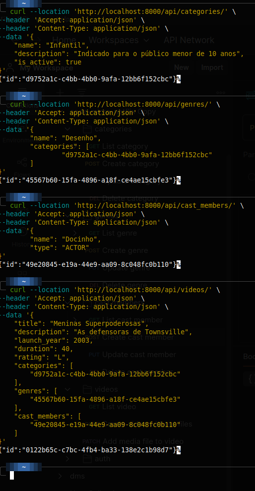

# Codeflix Project

## Overview

Codeflix is a project designed to manage categories and genres for a media catalog. It includes functionalities for creating, updating, listing, and deleting categories, genres, cast members and videos. The project is structured to support both unit and integration tests, ensuring robust and reliable code.

## Features

- Create, get, update, list, and delete categories.
- Create, update, list and delete genres and cast members.
- Create video without media, retrieve video details, and upload video media files.
- Integration with Django Rest Framework for API endpoints.
- Local file storage for video media.
- Comprehensive test coverage using pytest.
- Docker support for containerized deployment.

## API Endpoints

#### It's important to end the end-point with / (slash)

### Categories

- `GET /api/categories/` - List all categories
- `POST /api/categories/` - Create a new category
- `PUT /api/categories/{id}/` - Update a category by ID
- `PATCH /api/categories/{id}/` - Partially update a category by ID
- `DELETE /api/categories/{id}/` - Delete a category by ID

### Genres

- `GET /api/genres/` - List all genres
- `POST /api/genres/` - Create a new genre
- `PUT /api/genres/{id}/` - Update a genre by ID
- `DELETE /api/genres/{id}/` - Delete a genre by ID

### Cast Members

- `GET /api/cast_members/` - List all cast members
- `POST /api/cast_members/` - Create a new cast member
- `PUT /api/cast_members/{id}/` - Update a cast member by ID
- `DELETE /api/cast_members/{id}/` - Delete a cast member by ID

### Videos

- `POST /api/videos/` - Create a new video without media
- `GET /api/videos/{id}/` - Retrieve a video by ID
- `PATCH /api/videos/{id}/` - Upload video media file

**Note:** List, update (PUT), and delete endpoints for videos are not yet implemented.

### Flash test commands

#### Creating a category

```bash
curl --location 'http://localhost:8000/api/categories/' \
--header 'Accept: application/json' \
--header 'Content-Type: application/json' \
--data '{
    "name": "Infantil",
    "description": "Indicado para o público menor de 10 anos",
    "is_active": true
}'
```

#### Creating a genre

- Replace `{category_id}` with the ID from the previous category creation response.

```bash
curl --location 'http://localhost:8000/api/genres/' \
--header 'Accept: application/json' \
--header 'Content-Type: application/json' \
--data '{
	"name": "Desenho",
	"categories": [
		"{category_id}"
	]
}'
```

#### Creating a cast member

```bash
curl --location 'http://localhost:8000/api/cast_members/' \
--header 'Accept: application/json' \
--header 'Content-Type: application/json' \
--data '{
	"name": "Docinho",
	"type": "ACTOR"
}'
```

#### Creating a video

- Replace `{category_id}`, `{genre_id}`, and `{cast_member_id}` with IDs from previous creation responses.

```bash
curl --location 'http://localhost:8000/api/videos/' \
--header 'Accept: application/json' \
--header 'Content-Type: application/json' \
--data '{
    "title": "Meninas Superpoderosas",
    "description": "As defensoras de Townsville",
    "launch_year": 2003,
    "duration": 40,
    "rating": "L",
    "categories": [
        "{category_id}"
    ],
    "genres": [
        "{genre_id}"
    ],
    "cast_members": [
        "{cast_member_id}"
    ]
}'
```

#### Uploading video media

- Replace `{video_id}` with the ID from the previous video creation response.
- Ensure `ShowDaXuxa.mp4` exists in your current directory.

```bash
curl --location --request PATCH 'http://localhost:8000/api/videos/{video_id}/' \
--header 'Accept: application/json' \
--form 'video_file=@"ShowDaXuxa.mp4"'
```

### Automated Testing Script

For convenience, we provide a bash script that automates the entire API testing workflow, including video upload.

#### Requirements

- `jq` - Command-line JSON processor
  - **Ubuntu/Debian**: `sudo apt-get install jq`
  - **MacOS**: `brew install jq`
- Django server running on `http://localhost:8000`
- `ShowDaXuxa.mp4` file in the project root directory

#### Running the Script

1. Ensure the Django server is running:
   ```bash
   python src/manage.py runserver
   ```

2. In a new terminal, run the test script:
   ```bash
   ./test_api.sh
   ```

The script will automatically:
- Create a category and capture its ID
- Create a genre linked to the category
- Create a cast member
- Create a video with all relationships
- Retrieve the video to verify creation
- Upload the video media file (`ShowDaXuxa.mp4`)
- Verify the file was saved correctly
- Display a summary with all created IDs

<p align="center">
  
</p>

## Getting Started

### Prerequisites

- Python 3.10+
- Docker (optional, for containerized deployment)

### Installation

1. Clone the repository:

   ```sh
   git clone https://github.com/edsonjabastos/codeflix.git
   cd codeflix
   ```

2. Create a virtual environment and activate it:

   ```sh
   python3 -m venv venv
   source venv/bin/activate
   ```

3. Install the required packages:

   ```sh
   pip install -r requirements.txt
   ```

### Running the Project

1. Apply migrations:

   ```sh
   python src/manage.py migrate
   ```

2. Run the development server:

   ```sh
   python src/manage.py runserver
   ```

3. Access the application at `http://127.0.0.1:8000/`.

### Running Tests

Tests are organized by **pytest markers** (see `src/pytest.ini`):

| Marker | Description | External deps |
|--------|-------------|---------------|
| `unit` | Domain, use case unit, adapter unit | None |
| `integration` | Use cases with in-memory adapters; consumer→use case→DB flow | None / SQLite test DB |
| `api` | Django/DRF HTTP tests (mocked JWT) | SQLite test DB |
| `e2e` | Full stack with real Keycloak | Keycloak |

**Fast default (no Docker):**
```sh
cd src && pytest
```

**Run by layer:**
```sh
cd src && pytest -m unit
cd src && pytest -m integration
cd src && pytest -m api
cd src && pytest -m e2e          # requires Keycloak
```

**Coverage report:**
```sh
cd src && pytest --cov=core --cov=django_project --cov-report=term-missing
```

**Orchestrated runner (Docker + import-linter):**
```sh
./run_tests.sh --fast-only       # no Docker — recommended for local dev
./run_tests.sh                 # fast + e2e (starts Keycloak)
./run_tests.sh --e2e-only      # e2e smoke tests only
```

**CI (GitHub Actions):** fast tests + coverage on every PR; E2E smoke tests on push to `main`.

### Using Docker

1. Build the Docker image:

   ```sh
   docker build -t codeflix-catalog-admin .
   ```

2. Run the Docker container:

   ```sh
   docker run -d -v ./src:/app codeflix-catalog-admin
   ```

## Project Structure

```
.
├── Dockerfile
├── README.md
├── requirements.txt
├── src
│   ├── config.py
│   ├── core
│   │   ├── castmember
│   │   │   ├── application
│   │   │   │   ├── exceptions.py
│   │   │   │   └── use_cases
│   │   │   │       ├── create_castmember.py
│   │   │   │       ├── delete_castmember.py
│   │   │   │       ├── list_castmember.py
│   │   │   │       └── update_castmember.py
│   │   │   ├── domain
│   │   │   │   ├── castmember.py
│   │   │   │   ├── castmember_repository.py
│   │   │   │   └── value_objects.py
│   │   │   └── tests
│   │   │       ├── domain
│   │   │       │   └── test_castmember.py
│   │   │       └── use_cases
│   │   │           ├── integration
│   │   │           │   ├── test_create_castmember.py
│   │   │           │   ├── test_delete_castmember.py
│   │   │           │   ├── test_list_castmember.py
│   │   │           │   └── test_update_castmember.py
│   │   │           └── unit
│   │   │               ├── test_create_castmember.py
│   │   │               ├── test_delete_castmember.py
│   │   │               ├── test_list_castmember.py
│   │   │               └── test_update_castmember.py
│   │   ├── category
│   │   │   ├── application
│   │   │   │   └── use_cases
│   │   │   │       ├── create_category.py
│   │   │   │       ├── delete_category.py
│   │   │   │       ├── exceptions.py
│   │   │   │       ├── get_category.py
│   │   │   │       ├── list_category.py
│   │   │   │       └── update_category.py
│   │   │   ├── domain
│   │   │   │   ├── category.py
│   │   │   │   └── category_repository.py
│   │   │   └── tests
│   │   │       ├── application
│   │   │       │   └── use_cases
│   │   │       │       ├── integration
│   │   │       │       │   ├── test_create_category.py
│   │   │       │       │   ├── test_delete_category.py
│   │   │       │       │   ├── test_get_category.py
│   │   │       │       │   ├── test_list_category.py
│   │   │       │       │   └── test_update_category.py
│   │   │       │       └── unit
│   │   │       │           ├── test_create_category.py
│   │   │       │           ├── test_delete_category.py
│   │   │       │           ├── test_get_category.py
│   │   │       │           ├── test_list_category.py
│   │   │       │           └── test_update_category.py
│   │   │       └── domain
│   │   │           └── test_category.py
│   │   ├── genre
│   │   │   ├── application
│   │   │   │   ├── exceptions.py
│   │   │   │   └── use_cases
│   │   │   │       ├── create_genre.py
│   │   │   │       ├── delete_genre.py
│   │   │   │       ├── list_genre.py
│   │   │   │       └── update_genre.py
│   │   │   ├── domain
│   │   │   │   ├── genre.py
│   │   │   │   └── genre_repository.py
│   │   │   └── tests
│   │   │       ├── application
│   │   │       │   └── use_cases
│   │   │       │       ├── integration
│   │   │       │       │   ├── test_create_genre.py
│   │   │       │       │   ├── test_delete_genre.py
│   │   │       │       │   ├── test_list_genre.py
│   │   │       │       │   └── test_update_genre.py
│   │   │       │       └── unit
│   │   │       │           ├── test_create_genre.py
│   │   │       │           ├── test_delete_genre.py
│   │   │       │           ├── test_list_genre.py
│   │   │       │           └── test_update_genre.py
│   │   │       └── domain
│   │   │           └── test_genre.py
│   │   ├── _shared
│   │   │   ├── application
│   │   │   │   ├── ports
│   │   │   │   └── use_cases
│   │   │   ├── domain
│   │   │   └── events
│   │   └── video
│   │       ├── application
│   │       │   ├── exceptions.py
│   │       │   └── use_cases
│   │       │       ├── create_video_without_media.py
│   │       │       ├── get_video.py
│   │       │       ├── process_audio_video_media.py
│   │       │       └── upload_video.py
│   │       ├── domain
│   │       │   ├── value_objects.py
│   │       │   ├── video.py
│   │       │   └── video_repository.py
│   │       └── tests
│   │           ├── application
│   │           │   └── use_cases
│   │           │       ├── integration
│   │           │       └── unit
│   │           └── domain
│   │               └── test_video.py
│   ├── .importlinter
│   ├── db.sqlite3
│   ├── django_project
│   │   ├── adapters
│   │   │   ├── auth
│   │   │   ├── composition
│   │   │   │   └── container.py
│   │   │   ├── messaging
│   │   │   ├── persistence
│   │   │   │   ├── django
│   │   │   │   └── in_memory
│   │   │   └── storage
│   │   ├── asgi.py
│   │   ├── castmember_app
│   │   │   ├── admin.py
│   │   │   ├── apps.py
│   │   │   ├── migrations
│   │   │   │   └── 0001_initial.py
│   │   │   ├── models.py
│   │   │   ├── serializers.py
│   │   │   ├── tests
│   │   │   │   ├── test_castmember_api.py
│   │   │   │   └── test_repository.py
│   │   │   └── views.py
│   │   ├── category_app
│   │   │   ├── admin.py
│   │   │   ├── apps.py
│   │   │   ├── migrations
│   │   │   │   ├── 0001_initial.py
│   │   │   │   └── 0002_alter_category_table.py
│   │   │   ├── models.py
│   │   │   ├── serializers.py
│   │   │   ├── tests
│   │   │   │   ├── test_category_api.py
│   │   │   │   ├── test_category_repository.py
│   │   │   │   └── test_auth_api.py
│   │   │   └── views.py
│   │   ├── genre_app
│   │   │   ├── admin.py
│   │   │   ├── apps.py
│   │   │   ├── migrations
│   │   │   │   ├── 0001_initial.py
│   │   │   │   └── 0002_genre_categories_alter_genre_table.py
│   │   │   ├── models.py
│   │   │   ├── serializers.py
│   │   │   ├── tests
│   │   │   │   ├── test_genre_api.py
│   │   │   │   └── test_repository.py
│   │   │   └── views.py
│   │   ├── settings.py
│   │   ├── urls.py
│   │   ├── video_app
│   │   │   ├── admin.py
│   │   │   ├── apps.py
│   │   │   ├── migrations
│   │   │   │   ├── 0001_initial.py
│   │   │   │   └── 0002_remove_video_opened_alter_video_rating.py
│   │   │   ├── models.py
│   │   │   ├── serializers.py
│   │   │   ├── tests
│   │   │   │   └── test_video_api.py
│   │   │   └── views.py
│   │   └── wsgi.py
│   ├── manage.py
│   ├── pytest.ini
│   ├── testing
│   │   ├── fixtures
│   │   │   ├── categories.py
│   │   │   ├── genres.py
│   │   │   ├── castmembers.py
│   │   │   └── videos.py
│   │   └── helpers
│   │       └── auth.py
│   └── tests_e2e
│       ├── test_auth_e2e.py
│       ├── test_castmember_api_e2e.py
│       ├── test_category_api_e2e.py
│       ├── test_genre_api_e2e.py
│       └── test_video_api_e2e.py
└── vscode
    └── settings.json
```
